# TRACE

**Think. Research. Assess. Check. Explain.**

> In a world where anyone can generate convincing information in seconds, the most valuable skill isn't knowing what to believe, it's knowing how to find out for yourself

TRACE is an AI-powered Media & Information Literacy (MIL) platform built for the **UNESCO Youth Hackathon 2026** ("Play Your Part: Youth Designing the Future of Media and Information Literacy")

Submit a claim, post, article, screenshot, or URL, and TRACE doesn't just hand you a verdict, it investigates the content in front of you: extracting the claim, tracing it to its source, gathering evidence for and against it, checking context, and explaining its reasoning in plain language. Then it shows you how to do the same investigation yourself next time

**TRACE does not simply tell you whether something is true or false. It teaches you how to determine that yourself.**

---

## Why TRACE

Most fact-checking tools work like this:

```
Content → AI verdict → TRUE / FALSE
```

You get an answer, not understanding,and no way to reproduce the process next time

TRACE works like this instead:

```
Content → Claim extraction → Source tracing → Evidence → Context → Assessment → Explanation → User learning
```

The gap TRACE is built for isn't "people can't find information" 
it's that **people are increasingly expected to evaluate information on their own, with little practical support for learning how.** That's a Media & Information Literacy problem, and TRACE is designed as an MIL tool first, an AI tool second


---

## How It Works

1. **Trace the Claim** — extract the actual checkable claim(s) from the submitted content
2. **Trace the Source** — find where the claim originated and examine the source's credibility
3. **Trace the Evidence** — retrieve supporting and contradicting evidence
4. **Assess** — weigh evidence quality, recency, context, and manipulation signals
5. **Explain** — surface the full reasoning chain instead of a black-box score
6. **Teach** — show the user how they could verify similar claims independently

### Example

**Claim:** "Coffee has been proven to prevent cancer."

**TRACE finds:** studies discussing associations between coffee and certain health outcomes — none supporting the absolute claim made in the post.

**Signals:** ⚠️ absolute language · ⚠️ no cited source · ⚠️ oversimplified science

**Assessment:** Questionable / Misleading — with the reasoning chain and verification steps shown, not just the label.

---

## MVP Scope

- [ ] Claim extraction
- [ ] Source tracing
- [ ] Web evidence retrieval
- [ ] Evidence comparison (supporting vs. contradicting)
- [ ] Source & context analysis
- [ ] Explainable, reasoning-chain assessment
- [ ] Multilingual interface (English, French, Arabic)
- [ ] "Learn how to verify" guidance
- [ ] Investigation history

**Input types:** URL, pasted text, screenshot/image, social media post

**Out of scope for the hackathon prototype:** browser extension, mobile app, gamified challenges, classroom dashboard, public API — see [long-term vision](#long-term-vision).

---

## Architecture

| Layer | Approach |
|---|---|
| Frontend | Next.js / React |
| Backend | Node.js / API routes |
| AI layer | LLM for claim extraction, reasoning, explanation, multilingual interaction |
| Retrieval layer | Hybrid search (keyword + semantic) with source ranking |
| Evidence layer | Structured store for claims, sources, evidence, timestamps, and relationships |

**Core principle: retrieval-grounded, not free-generation.** Every assessment TRACE makes must be tied to evidence that was actually retrieved and can be inspected — the model isn't allowed to just assert an answer from its own internal knowledge.

---

## Why This Matters (MIL Alignment)

| MIL Skill | How TRACE Builds It |
|---|---|
| Finding information | Source & evidence retrieval |
| Evaluating sources | Source credibility assessment |
| Understanding context | Context analysis |
| Detecting manipulation | Manipulation indicators |
| Comparing information | Supporting vs. contradicting evidence |
| Critical thinking | Guided user investigation |
| Independent verification | "Learn how to verify" step |
| Digital citizenship | Responsible information consumption |

---

## Responsible AI

TRACE can be wrong, and it's designed to say so rather than hide it:

- Every assessment cites its actual evidence
- Uncertainty is stated explicitly, never smoothed over
- Multiple sources are compared, not just one
- Evidence and inference are kept visibly distinct
- An honest "insufficient evidence" state exists and is used when warranted

**TRACE should help users question information — including TRACE itself.**

---

## features

- **Multilingual Tracing**: Unlike tools that treat non-English languages as an afterthought, TRACE is built to track claims across English, French, and Arabic (including Tunisian dialect) from the start


- **Diverse Input Support**: Users can submit URLs, pasted text, screenshots, or social media posts for investigation


- **Sourcing Sherlock**: A side-by-side comparison view that highlights the specific sentence in a primary source that supports or contradicts the viral claim.

- **Ancestry Map**: A visual timeline showing the "Game of Telephone" a claim played as it moved from an original source to a viral post, showing where context was lost

- **Investigation History**: A simple log for users to track their past verifications

## architecture

```mermaid
flowchart TD

subgraph group_web["Next.js App"]
  node_shell["App shell<br/>Next.js layout<br/>[layout.tsx]"]
  node_landing["Landing page<br/>Next.js page<br/>[page.tsx]"]
  node_investigate_page["Investigate route<br/>Next.js page<br/>[page.tsx]"]
  node_investigate_api{{"Investigation API<br/>route handler<br/>[route.ts]"}}
  node_ocr_api{{"OCR API<br/>route handler<br/>[route.ts]"}}
  node_learn_page["Learning content<br/>Next.js page<br/>[page.tsx]"]
  node_lab_page["Lab route<br/>Next.js page<br/>[page.tsx]"]
  node_lab_api{{"Lab evaluation API<br/>route handler<br/>[route.ts]"}}
end

subgraph group_ui["User Experiences"]
  node_investigate_ui["Investigation experience<br/>React UI"]
  node_live_results["Live investigation view<br/>React UI"]
  node_learn_ui["Learning experience<br/>React UI<br/>[LearnContent.tsx]"]
  node_lab_game["Lab game<br/>React UI<br/>[LabGame.tsx]"]
end

subgraph group_pipeline["Investigation Pipeline"]
  node_orchestrator["Investigation orchestrator<br/>pipeline service"]
  node_claims["Claim extraction<br/>pipeline stage<br/>[extractClaims.ts]"]
  node_source_trace["Source tracing<br/>pipeline stage<br/>[traceSource.ts]"]
  node_evidence["Evidence retrieval<br/>pipeline stage"]
  node_assessment["Evidence assessment<br/>pipeline stage<br/>[assess.ts]"]
end

subgraph group_data["Data &amp; Integrations"]
  node_ocr_language["OCR language data<br/>OCR model data<br/>[eng.traineddata]"]
  node_search["Web retrieval adapters<br/>retrieval integration<br/>[tavily.ts]"]
  node_verification_search["Verification search<br/>retrieval helper<br/>[verifySearch.ts]"]
  node_signals["Manipulation signals<br/>heuristics"]
  node_trace_types["Trace contract<br/>shared types<br/>[trace.ts]"]
  node_supabase[("Supabase persistence<br/>database integration<br/>[supabase.ts]")]
  node_schema["Trace schema<br/>SQL schema<br/>[schema.sql]"]
  node_lab_claims["Lab claims<br/>local content<br/>[claims.ts]"]
end

node_shell -->|"frames"| node_landing
node_shell -->|"frames"| node_investigate_page
node_investigate_page -->|"renders"| node_investigate_ui
node_investigate_ui -->|"submits image"| node_ocr_api
node_ocr_language -->|"OCR data"| node_ocr_api
node_ocr_api -->|"OCR text"| node_investigate_api
node_investigate_ui -->|"submits text or URL"| node_investigate_api
node_investigate_api -->|"runs"| node_orchestrator
node_orchestrator -->|"extracts"| node_claims
node_claims -->|"claims"| node_source_trace
node_source_trace -->|"origin context"| node_evidence
node_evidence -->|"grounding evidence"| node_assessment
node_search -->|"web results"| node_evidence
node_verification_search -->|"verification results"| node_evidence
node_signals -->|"heuristics"| node_assessment
node_assessment -->|"explained judgment"| node_orchestrator
node_orchestrator -->|"persists trace"| node_supabase
node_schema -->|"defines relations"| node_supabase
node_orchestrator -->|"returns contract"| node_trace_types
node_trace_types -->|"typed result"| node_live_results
node_investigate_api -->|"investigation chain"| node_live_results
node_investigate_ui -->|"renders"| node_live_results
node_learn_page -->|"renders"| node_learn_ui
node_lab_page -->|"renders"| node_lab_game
node_lab_claims -->|"challenge content"| node_lab_game
node_lab_game -->|"submits evaluation"| node_lab_api

click node_shell "https://github.com/youcef3939/trace/blob/main/app/layout.tsx"
click node_landing "https://github.com/youcef3939/trace/blob/main/app/page.tsx"
click node_investigate_page "https://github.com/youcef3939/trace/blob/main/app/investigate/page.tsx"
click node_investigate_ui "https://github.com/youcef3939/trace/blob/main/components/InvestigateExperience.tsx"
click node_live_results "https://github.com/youcef3939/trace/blob/main/components/InvestigationLive.tsx"
click node_investigate_api "https://github.com/youcef3939/trace/blob/main/app/api/investigate/route.ts"
click node_ocr_api "https://github.com/youcef3939/trace/blob/main/app/api/ocr/route.ts"
click node_ocr_language "https://github.com/youcef3939/trace/blob/main/eng.traineddata"
click node_orchestrator "https://github.com/youcef3939/trace/blob/main/lib/pipeline/runInvestigation.ts"
click node_claims "https://github.com/youcef3939/trace/blob/main/lib/pipeline/extractClaims.ts"
click node_source_trace "https://github.com/youcef3939/trace/blob/main/lib/pipeline/traceSource.ts"
click node_evidence "https://github.com/youcef3939/trace/blob/main/lib/pipeline/retrieveEvidence.ts"
click node_assessment "https://github.com/youcef3939/trace/blob/main/lib/pipeline/assess.ts"
click node_search "https://github.com/youcef3939/trace/blob/main/lib/tavily.ts"
click node_verification_search "https://github.com/youcef3939/trace/blob/main/lib/verifySearch.ts"
click node_signals "https://github.com/youcef3939/trace/blob/main/lib/manipulationSignals.ts"
click node_trace_types "https://github.com/youcef3939/trace/blob/main/types/trace.ts"
click node_supabase "https://github.com/youcef3939/trace/blob/main/lib/supabase.ts"
click node_schema "https://github.com/youcef3939/trace/blob/main/supabase/schema.sql"
click node_learn_page "https://github.com/youcef3939/trace/blob/main/app/learn/page.tsx"
click node_learn_ui "https://github.com/youcef3939/trace/blob/main/components/LearnContent.tsx"
click node_lab_page "https://github.com/youcef3939/trace/blob/main/app/lab/page.tsx"
click node_lab_game "https://github.com/youcef3939/trace/blob/main/components/lab/LabGame.tsx"
click node_lab_claims "https://github.com/youcef3939/trace/blob/main/lib/lab/claims.ts"
click node_lab_api "https://github.com/youcef3939/trace/blob/main/app/api/lab/evaluate/route.ts"

classDef toneNeutral fill:#f8fafc,stroke:#334155,stroke-width:1.5px,color:#0f172a
classDef toneBlue fill:#dbeafe,stroke:#2563eb,stroke-width:1.5px,color:#172554
classDef toneAmber fill:#fef3c7,stroke:#d97706,stroke-width:1.5px,color:#78350f
classDef toneMint fill:#dcfce7,stroke:#16a34a,stroke-width:1.5px,color:#14532d
classDef toneRose fill:#ffe4e6,stroke:#e11d48,stroke-width:1.5px,color:#881337
classDef toneIndigo fill:#e0e7ff,stroke:#4f46e5,stroke-width:1.5px,color:#312e81
classDef toneTeal fill:#ccfbf1,stroke:#0f766e,stroke-width:1.5px,color:#134e4a
class node_shell,node_landing,node_investigate_page,node_investigate_api,node_ocr_api,node_learn_page,node_lab_page,node_lab_api toneBlue
class node_investigate_ui,node_live_results,node_learn_ui,node_lab_game toneAmber
class node_orchestrator,node_claims,node_source_trace,node_evidence,node_assessment toneMint
class node_ocr_language,node_search,node_verification_search,node_signals,node_trace_types,node_supabase,node_schema,node_lab_claims toneRose
```



## Long-Term Vision

Beyond the hackathon prototype:

- **TRACE Web** — the main investigation platform
- **TRACE Browser Extension** — investigate content in-place
- **TRACE Mobile** — investigate posts and messages where people receive them
- **TRACE Learn** — interactive media-literacy courses
- **TRACE Challenge** — gamified misinformation-detection practice
- **TRACE Classroom** — tools for teachers
- **TRACE API** — integration for educational platforms and organizations

---

## Team

Built by a two-person youth team from Tunisia for the UNESCO Youth Hackathon 2026

**Youcef chalbi** - computer engineering student

**hamdi Belhadj** - cloud engineering student

---

## License

MIT
